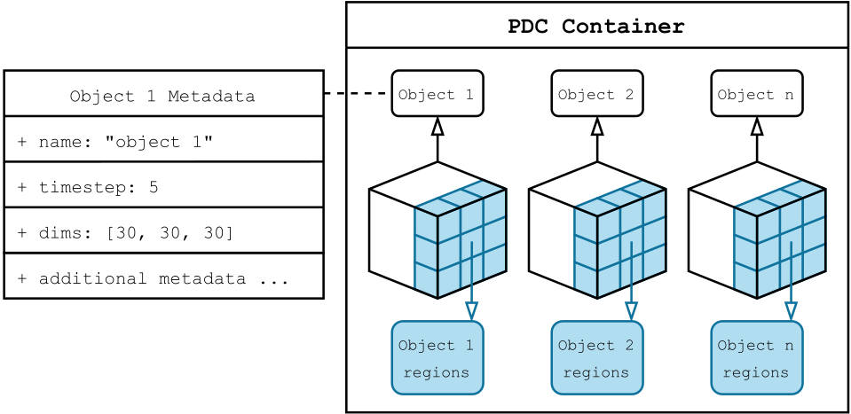

.. _core_concepts:

**2.** Core Concepts
====================

**2.1.** PDC abstractions
-------------------------

PDC provides several core abstractions for modeling and managing data.

   Relationship between PDC containers, objects, and regions.

Containers
~~~~~~~~~~

- Logical groupings of related data objects, similar to folders or directories  
- Associated with metadata such as creation time and persistance

Objects
~~~~~~~

- Represent a combination of raw data and descriptive metadata  
- Structured as multidimensional arrays (e.g., 1D, 2D, or 3D) to support scientific data layouts
- Can be queried, updated, and transferred without referencing physical storage directly  

Object Metadata
~~~~~~~~~~~~~~~

- Two types: predefined and custom
- **Predefined metadata** (automatically maintained by PDC):
  
  - `object_name` — the name of the object
  - `dimensions` — the shape of the object (e.g., 1D, 2D, 3D)
  - `timestep` — the simulation or data timestep associated with this object
  - `creation_time` — timestamp when the object was created

- **Custom metadata**: user defined key-value pairs.
- Supports efficient creation, insertion, update, and deletion operations

Regions
~~~~~~~

- Represent the fundamental unit of data access in PDC  
- Defined as sub-sections within an object  
- Defined as multidimensional sub-sections within an object  
- Used to read or write portions of data during transfers  

.. note::
   PDC currently supports a maximum of 3 dimensions for both objects and regions.

**2.2.** Architecture of PDC
----------------------------

PDC is built on a distributed client-server architecture optimized for 
high-performance computing (HPC) environments. In this model, clients 
are user processes that interact with the PDC client library and API 
to initiate data creation, movement, querying, and transformation. 
Servers are background processes that carry out these operations as 
requested by the clients. Communication between clients and servers 
is handled via Mercury RPCs and, when enabled, MPI. This architecture 
supports scalable, asynchronous, and metadata-rich operations that decouple 
the data model from the physical data location.

Data Management and Movement
~~~~~~~~~~~~~~~~~~~~~~~~~~~~

PDC manages both data and metadata in a way that optimizes movement across 
deep memory hierarchies. Data is stored in objects and moved asynchronously 
through region-based APIs, while metadata is distributed and indexed to support 
scalable querying.  

**2.3.** Properties
-------------------

Properties determine how objects, containers, etc., behave. 
Once created, the property list can be configured through additional function calls that 
append or modify properties. These customized property lists can then be 
used in later calls to control the behavior of the associated entities. Some 
examples of configurable properties are shown below.

Container Properties
~~~~~~~~~~~~~~~~~~~~

Container properties define key attributes that determine the behavior and 
lifecycle of containers within the system. These properties are typically 
specified at container creation time and can be queried or modified via 
container-related functions.

- **Lifetime**  
  Containers can be created with a specified lifetime, such as *persistent* or *transient*. 
  Persistent containers remain accessible across multiple sessions, whereas transient containers 
  exist only for the duration of a program's execution.

- **Creation and Opening**  
  Containers can be created and opened either individually or collectively (across multiple ranks), 
  enabling both independent and coordinated container management.

- **Information and Iteration**  
  Once created or opened, container properties and metadata can be retrieved through information 
  query functions. Containers can also be iterated over to discover all containers within a 
  given context.

- **Persistence Control**  
  Transient containers can be explicitly persisted to extend their lifetime beyond the current execution.

- **Initialization and Finalization**  
  The container subsystem provides explicit initialization and finalization calls to manage resources properly.

Object Properties
~~~~~~~~~~~~~~~~~

Object properties characterize the essential attributes and behavior of objects managed within containers. 
These properties define the shape, type, location, and metadata associated with an object, enabling 
precise control over how the object is created, accessed, and managed.

- **Initialization and Creation**  
  Objects are initialized within a container context and can be created either locally or collectively, 
  allowing flexibility in parallel or distributed environments.

- **Data Type and Dimensionality**  
  Properties specify the variable type of the object data (such as integer or float) as well as its 
  dimensions, which can include fixed sizes or support for unlimited dimensions.

- **Metadata and Tags**  
  Objects can carry associated metadata such as user IDs, application names, time steps, data 
  location paths, and user-defined tags to facilitate identification and management.

- **Consistency and Partitioning**  
  Properties include options to define consistency semantics and data transfer partitioning 
  strategies, helping optimize performance and correctness in concurrent access scenarios.

- **Buffers and Caching**  
  Objects can be linked with data buffers, and explicit control over cache flushing is 
  supported to ensure data integrity and synchronization.

- **Lifecycle and Management**  
  Object properties support lifecycle operations such as opening, closing, iterating over 
  multiple objects within a container, and deleting objects when no longer needed.

- **Query and Modification**  
  Functions allow querying and modifying object properties and dimensions dynamically, supporting 
  evolving data and usage patterns.

**2.4.** Data Access Lifecycle
------------------------------

The data access lifecycle in PDC describes the sequence of steps through which 
data objects are defined, connected to storage regions, transferred, and finalized. 
This process enables structured, efficient, and flexible management of data in both 
individual and distributed environments.

Object Creation
~~~~~~~~~~~~~~~

The lifecycle begins with the creation of an object within a selected container.  
At this stage, object attributes such as data type, size, dimensionality, and associated 
metadata are defined. The container serves as the logical namespace for the object, 
organizing related objects and their properties. Once configured, the object becomes 
accessible for subsequent I/O and metadata operations.

Region Definition and Association
~~~~~~~~~~~~~~~~~~~~~~~~~~~~~~~~~

Before data can be transferred, one or more local and target regions are defined to specify which 
portions  of the memory space and subsets of an object are involved in an operation. These regions 
provide a mapping between in-memory data and the logical layout of objects, enabling 
fine-grained control over data placement. Multiple regions may be 
transferred at once to support batch operations.

Consistency Options
~~~~~~~~~~~~~~~~~~~

Data can be exchanged between memory and storage using different consistency models, 
such as synchronous (POSIX) or asynchronous (eventual) I/O. 
Applications can choose or even dynamically adjust the consistency mode depending on their 
specific requirements-favoring strict consistency when immediate visibility of updates is critical,
or opting for eventual consistency to improve performance and overlap computation with data movement 
in parallel or distributed workflows.

- **POSIX Consistency**  
  Synchronous reads and writes are enforced. 
  All operations are immediately visible to all processes, ensuring strict consistency.

- **Eventual Consistency**  
  Updates are performed asynchronously. Reads may return stale data until updates propagate, allowing computation and communication to overlap and improving performance in parallel workflows.

Finalization
~~~~~~~~~~~~

After all data transfers and operations have completed, the associated resources 
are released in an orderly manner. Containers and objects are closed, data buffers 
are flushed to ensure consistency, and any temporary or transient entities are 
cleaned up. Finalization marks the end of the object's lifecycle within the current 
execution context, ensuring all resources are safely deallocated.