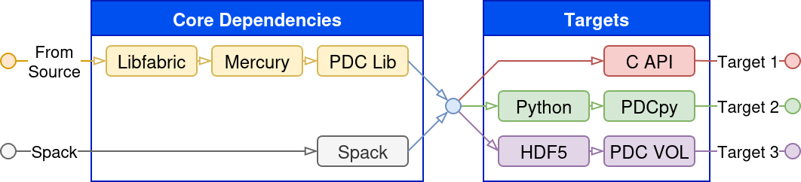

.. _introduction:

**1.** Introduction
===================

**1.1.** What is PDC
--------------------

Proactive Data Containers (PDC) is an object-focused data management API, 
a runtime system with a set of scalable data object management services, 
and tools for managing data objects stored in the PDC system.

The main goal of PDC is to simplify data management by providing abstractions of 
data and metadata as Objects, organized in Containers. To allow multiple parallel processes, 
a.k.a., Message Passing Interface (MPI) ranks, concurrent access (reads and writes) 
to data in objects, PDC provides an abstraction of Regions. Metadata is organized with 
Attributes managed in key-value (KV) pairs.

Simplicity of the PDC comes from its application programming interface (API), 
which allows users to describe an object, add metadata (attributes) to the 
object, and concurrently access the object. PDC allows efficient and transparent 
data movement in complex memory and storage hierarchy without application programmers 
needing to move the data in the hierarchy. The runtime system of PDC performs data 
movement asynchronously and provides scalable metadata operations to find and manipulate 
data objects. PDC revolutionizes how data is managed and accessed by using object-centric 
abstractions to represent data that moves in the high-performance computing (HPC) memory 
and storage subsystems. PDC manages extensive metadata to describe data objects to find 
desired data efficiently as well as to store information in the data objects. PDC decides 
on data layouts to take advantage of underlying parallel file systems transparently from 
the users. Users can query the metadata to find the data objects and portions of the 
data objects (i.e., regions) and access them.

Overall, PDC is a novel data management software for easing the pain of managing 
data in HPC systems and allowing runtime systems to make intelligent decisions 
regarding data movement. Core concepts of PDC are available 
in :doc:`Core Concepts <core_concepts>`..

To cite PDC, use the following.

Suren Byna, Bin Dong, Houjun Tang, Quincey Koziol, Jingqing Mu, Jerome Soumagne, Venkat Vishwanath, Richard Warren, and François Tessier, "Proactive Data Containers (PDC) v0.1. Computer Software", https://github.com/hpc-io/pdc. USDOE. 11 May. 2017. Web. doi:10.11578/dc.20210325.1

**1.2.** Installation
---------------------

PDC offers the following methods for installing core dependencies:

1. :ref:`Spack <link_spack>`
2. :ref:`PDC Source <pdc-source>`

PDC offers the following installation targets:

1. `C API`
2. :ref:`Python API (PDCpy) <python-api-pdc-py>`
3. :ref:`HDF5 VOL Connector (VOL-PDC) <hdf5-vol-connector>`



   Installation workflow to install the client targets offered by PDC.

.. note::

    All installation targets require the PDC core dependencies to be installed
    either via spack or directly from the compiled source code.

.. _link_spack:

Spack
~~~~~

Spack is a package manager for supercomputers, Linux, and macOS. 
It makes installing scientific software easy.
More information about Spack can be found at: https://spack.io.
PDC and its dependencies can be installed with spack:

.. code-block:: bash

   # Clone the Spack repository
   git clone -c feature.manyFiles=true https://github.com/spack/spack.git

   # Source the Spack setup script
   . ./spack/share/spack/setup-env.sh

   # Create a new environment for PDC
   spack env create pdc-env
   spack env activate pdc-env

   # Add PDC to the environment with tests enabled
   HG_HOST=eth0 spack install --add --test=root --verbose pdc ^libfabric fabrics=tcp,rxm

   # Load PDC to verify the installation
   spack load pdc
   pdc --version

.. _pdc-source:

.. note::

    To view an exhaustive list of compile-time options please see :ref:`compile_time_options`.

PDC Source
~~~~~~~~~~

We recommend using GCC version 7 or later. Intel and Cray compilers also work.

When building PDC from source, either MPICH or OpenMPI can be used as the MPI library, if your system
doesn't have one installed, follow `MPICH Installers Guide <https://www.mpich.org/documentation/guides>`_ 
or `Installing Open MPI <https://docs.open-mpi.org/en/v5.0.x/installing-open-mpi/quickstart.html>`_

We provide detailed instructions for installing libfabric, Mercury, and the PDC library below.

.. attention:: 

   Following the instructions below will record all the environmental variables 
   needed to run PDC in the ``$WORK_SPACE/pdc_env.sh`` file, which can be used for 
   future PDC runs with ``source $WORK_SPACE/pdc_env.sh``.

Prepare Work Space
~~~~~~~~~~~~~~~~~~

Before installing the dependencies and downloading the code repositories, we assume
there is a directory created for your installation already, e.g. ``$WORK_SPACE`` and 
that you are in the ``$WORK_SPACE`` directory.

.. code-block:: Bash

   export WORK_SPACE=/path/to/your/work/space
   mkdir -p $WORK_SPACE/source
   mkdir -p $WORK_SPACE/install

   cd $WORK_SPACE/source
   git clone https://github.com/ofiwg/libfabric
   git clone https://github.com/mercury-hpc/mercury --recursive
   git clone https://github.com/hpc-io/pdc

   export LIBFABRIC_SRC_DIR=$WORK_SPACE/source/libfabric
   export MERCURY_SRC_DIR=$WORK_SPACE/source/mercury
   export PDC_SRC_DIR=$WORK_SPACE/source/pdc

   export LIBFABRIC_DIR=$WORK_SPACE/install/libfabric
   export MERCURY_DIR=$WORK_SPACE/install/mercury
   export PDC_DIR=$WORK_SPACE/install/pdc

   mkdir -p $LIBFABRIC_SRC_DIR
   mkdir -p $MERCURY_SRC_DIR
   mkdir -p $PDC_SRC_DIR

   mkdir -p $LIBFABRIC_DIR
   mkdir -p $MERCURY_DIR
   mkdir -p $PDC_DIR

   # Save the environment variables to a file
   echo "export LIBFABRIC_SRC_DIR=$LIBFABRIC_SRC_DIR" > $WORK_SPACE/pdc_env.sh
   echo "export MERCURY_SRC_DIR=$MERCURY_SRC_DIR" >> $WORK_SPACE/pdc_env.sh
   echo "export PDC_SRC_DIR=$PDC_SRC_DIR" >> $WORK_SPACE/pdc_env.sh
   echo "export LIBFABRIC_DIR=$LIBFABRIC_DIR" >> $WORK_SPACE/pdc_env.sh
   echo "export MERCURY_DIR=$MERCURY_DIR" >> $WORK_SPACE/pdc_env.sh
   echo "export PDC_DIR=$PDC_DIR" >> $WORK_SPACE/pdc_env.sh

From now on you can simply run the following commands to set the environment variables:

.. code-block:: Bash

   export WORK_SPACE=/path/to/your/work/space
   source $WORK_SPACE/pdc_env.sh

Install libfabric
~~~~~~~~~~~~~~~~~

.. code-block:: Bash

   cd $LIBFABRIC_SRC_DIR
   git checkout v1.18.0
   ./autogen.sh
   ./configure --prefix=$LIBFABRIC_DIR CC=mpicc CFLAG="-O2"
   make -j && make install

   # Test the installation
   make check

   # Set the environment variables
   export LD_LIBRARY_PATH="$LIBFABRIC_DIR/lib:$LD_LIBRARY_PATH"
   export PATH="$LIBFABRIC_DIR/include:$LIBFABRIC_DIR/lib:$PATH"
   echo 'export LD_LIBRARY_PATH=$LIBFABRIC_DIR/lib:$LD_LIBRARY_PATH' >> $WORK_SPACE/pdc_env.sh
   echo 'export PATH=$LIBFABRIC_DIR/include:$LIBFABRIC_DIR/lib:$PATH' >> $WORK_SPACE/pdc_env.sh

.. note::

   ``CC=mpicc`` may need to be changed to the corresponding compiler 
   in your system, e.g. ``CC=cc`` or ``CC=gcc``.
   On Perlmutter@NERSC, ``--disable-efa --disable-sockets`` should be 
   added to the ``./configure`` command when compiling on login nodes.

.. attention::

   When installing on MacOS, make sure to enable ``sockets`` with the following configure command:
   ``./configure CFLAG=-O2 --enable-sockets=yes --enable-tcp=yes --enable-udp=yes --enable-rxm=yes``

Install Mercury
~~~~~~~~~~~~~~~

.. code-block:: Bash

   cd $MERCURY_SRC_DIR

   # Checkout a release version
   git checkout v2.2.0
   mkdir build
   cd build
   cmake -DCMAKE_INSTALL_PREFIX=$MERCURY_DIR -DCMAKE_C_COMPILER=mpicc -DBUILD_SHARED_LIBS=ON \
         -DBUILD_TESTING=ON -DNA_USE_OFI=ON -DNA_USE_SM=OFF -DNA_OFI_TESTING_PROTOCOL=tcp ../
   make -j && make install

   # Test the installation
   ctest

   # Set the environment variables
   export LD_LIBRARY_PATH="$MERCURY_DIR/lib:$LD_LIBRARY_PATH"
   export PATH="$MERCURY_DIR/include:$MERCURY_DIR/lib:$PATH"
   echo 'export LD_LIBRARY_PATH=$MERCURY_DIR/lib:$LD_LIBRARY_PATH' >> $WORK_SPACE/pdc_env.sh
   echo 'export PATH=$MERCURY_DIR/include:$MERCURY_DIR/lib:$PATH' >> $WORK_SPACE/pdc_env.sh

.. note::

   ``CC=mpicc`` may need to be changed to the corresponding compiler in your system, e.g. 
   ``-DCMAKE_C_COMPILER=cc`` or ``-DCMAKE_C_COMPILER=gcc``.
   Make sure the ctest passes. PDC may not work without passing 
   all the tests of Mercury.

.. attention::

   When installing on MacOS, specify the ``sockets`` protocol used by Mercury by replacing 
   the cmake command from ``-DNA_OFI_TESTING_PROTOCOL=tcp`` to ``-DNA_OFI_TESTING_PROTOCOL=sockets``

Install PDC Source
~~~~~~~~~~~~~~~~~~

.. code-block:: Bash

   cd $PDC_SRC_DIR
   git checkout develop
   mkdir build
   cd build
   cmake -DBUILD_MPI_TESTING=ON -DBUILD_SHARED_LIBS=ON -DBUILD_TESTING=ON -DCMAKE_INSTALL_PREFIX=$PDC_DIR \
         -DPDC_ENABLE_MPI=ON -DMERCURY_DIR=$MERCURY_DIR -DCMAKE_C_COMPILER=mpicc -DMPI_RUN_CMD=mpiexec ../
   make -j && make install

   # Set the environment variables
   export LD_LIBRARY_PATH="$PDC_DIR/lib:$LD_LIBRARY_PATH"
   export PATH="$PDC_DIR/include:$PDC_DIR/lib:$PATH"	
   echo 'export LD_LIBRARY_PATH=$PDC_DIR/lib:$LD_LIBRARY_PATH' >> $WORK_SPACE/pdc_env.sh
   echo 'export PATH=$PDC_DIR/include:$PDC_DIR/lib:$PATH' >> $WORK_SPACE/pdc_env.sh

.. _compile_time_options:

Compile-Time Options
~~~~~~~~~~~~~~~~~~~~

The following table lists all available compile-time options for PDC, along with a description of each and their current support status:

.. list-table:: Compile-Time Macros
   :header-rows: 1
   :widths: 30 10 50 10

   * - Option Name
     - Default
     - Description
     - Support
   * - BUILD_MPI_TESTING
     - ON
     - Build MPI testing.
     - 🟢
   * - BUILD_SHARED_LIBS
     - ON
     - Build with shared libraries.
     - 🟢
   * - BUILD_TESTING
     - ON
     - Build the testing tree.
     - 🟢
   * - BUILD_TOOLS
     - OFF
     - Build tools.
     - 🟢
   * - PDC_DART_SUFFIX_TREE_MODE
     - ON
     - Enable DART Suffix Tree mode.
     - 🟢
   * - PDC_ENABLE_APP_CLOSE_SERVER
     - OFF
     - Close PDC server at the end of the application.
     - 🟢
   * - PDC_ENABLE_CHECKPOINT
     - ON
     - Enable checkpointing.
     - 🟢
   * - PDC_ENABLE_FASTBIT
     - OFF
     - Enable FastBit.
     - 🟢
   * - PDC_ENABLE_JULIA_SUPPORT
     - OFF
     - Enable Julia support.
     - 🟢
   * - PDC_ENABLE_LUSTRE
     - OFF
     - Enable Lustre.
     - 🟢
   * - PDC_ENABLE_MPI
     - ON
     - Enable MPI.
     - 🟢
   * - PDC_ENABLE_MULTITHREAD
     - OFF
     - Enable multithreading.
     - 🟡
   * - PDC_ENABLE_PROFILING
     - OFF
     - Enable profiling.
     - 🔴
   * - PDC_ENABLE_ROCKSDB
     - OFF
     - Enable RocksDB (experimental).
     - 🟢
   * - PDC_ENABLE_SQLITE3
     - OFF
     - Enable SQLite3 (experimental).
     - 🟢
   * - PDC_ENABLE_TF_ZFP_COMPRESSION
     - ON
     - TensorFlow + ZFP compression (no inline help).
     - 🟡
   * - PDC_ENABLE_WAIT_DATA
     - OFF
     - Wait for data finalized in FS when object unmap is called.
     - 🟢
   * - PDC_ENABLE_ZFP
     - OFF
     - Enable ZFP.
     - 🟡
   * - PDC_HAVE_ATTRIBUTE_UNUSED
     - ON
     - Use compiler attribute for unused variables.
     - 🟢
   * - PDC_SERVER_CACHE
     - ON
     - Enable server caching.
     - 🟢
   * - PDC_TIMING
     - OFF
     - Enable timing.
     - 🟡
   * - PDC_USE_CRAY_DRC
     - OFF
     - Use Cray DRC to allow multi-job communication.
     - 🟢
   * - PDC_USE_SHARED_SERVER
     - OFF
     - Use shared server with client mode.
     - 🟢

Legend:

- 🟢 = Fully supported
- 🟡 = Partially/experimentally supported
- 🔴 = Not supported or currently disabled

Several parameters can be specified at compile-time
and then subsequently overwritten at runtime by
setting the appropriate environment variable.

Runtime Options
~~~~~~~~~~~~~~~

- PDC_DATA_LOC: Data directory path.
- PDC_TMPDIR: Metadata directory path.
- PDC_BB_LOC: Burst buffer directory path.
- PDC_SERVER_CACHE_MAX_SIZE: Max server side cache size (GB).
- PDC_SERVER_IDLE_CACHE_FLUSH_TIME: Time interval of the server side cache inactivity before automatic flush (sec).
- PDC_SERVER_CACHE_NO_FLUSH: Disable the flushing of the server side cache.
- HG_TRANSPORT: Specifies the Mercury communication transport protocol.
- HG_HOST: Defines the hostname or IP address used by the Mercury network layer.

.. note::

   ``-DCMAKE_C_COMPILER=mpicc -DMPI_RUN_CMD=mpiexec`` may need to be 
   changed to ``-DCMAKE_C_COMPILER=cc -DMPI_RUN_CMD=srun`` depending on your system environment.

   If you are trying to compile PDC on MacOS, ``LibUUID`` needs to be installed 
   on your MacOS first. Simple use ``brew install ossp-uuid`` to install it.
   If you are trying to compile PDC on Linux, you should also make sure ``LibUUID`` 
   is installed on your system. If not, you can install it with 
   ``sudo apt-get install uuid-dev`` on Ubuntu or ``yum install libuuid-devel`` on CentOS.

   In MacOS you also need to export the following environment variable so PDC 
   (i.e., Mercury) uses the ``socket`` protocol, the only one supported in 
   MacOS: ``export HG_TRANSPORT="sockets"``.

Test Your PDC Source Installation
~~~~~~~~~~~~~~~~~~~~~~~~~~~~~~~~~

PDC has both sequential and parallel (MPI) tests which can be run 
with using the following command in the ``build`` directory.

.. code-block:: Bash

   ctest

You can also specify a timeout (e.g., 2 minutes) for the tests by specifying 
the ``timeout`` parameter when calling ``ctest``:

.. code-block:: Bash

   ctest --timeout 120

If PDC was built without support for MPI, you can run only the sequential (non-MPI) tests
using the ``-L serial`` parameter:

.. code-block:: Bash

    ctest -L serial

.. note::

   If you are using PDC on an HPC system, e.g. Perlmutter@NERSC, ``ctest`` should be run 
   on a compute node, you can submit an interactive job on Perlmutter: 
   ``salloc --nodes 1 --qos interactive --time 01:00:00 --constraint cpu --account=mxxxx``

.. _python-api-pdc-py:

**1.3.** Python API (PDCpy)
---------------------------------

Due to the rise of Python in the HPC community, PDC provides Python
bindings, which allows users to interact with PDC using Python.
The repository for PDCpy can be found at `PDCpy GitHub Repository <https://github.com/hpc-io/PDCpy>`_.
The documentation for PDCpy's API is available at `PDCpy Documentation <https://hpc-io.github.io/PDCpy/>`_.

PDCpy is compatible with OpenMPI and MPICH. If neither MPI library is installed,
it will attempt to compile without MPI support, which will fail if you compile
PDC with MPI support.

Dependencies
~~~~~~~~~~~~

First ensure PDC is installed either compiled directly from the
source code or via spack (see instructions above).

.. note::

    The Python interface currently only works with the `develop`
    branch of PDC.

Then clone the PDCpy repository:

.. code-block:: Bash

    git clone https://github.com/hpc-io/PDCpy.git

Installation
~~~~~~~~~~~~

Make sure the following environment variables are correct:

1. `PDC_DIR`: path to PDC installation
2. `MERCURY_DIR`: path to mercury installation
3. `LD_LIBRARY_PATH`: contains path to `libpdc.so`

.. code-block:: Bash

    pip install PDCpy


.. _hdf5-vol-connector:

**1.4.** HDF5 VOL Connector (VOL-PDC)
-------------------------------------

The following instructions are for installing PDC on Linux and Cray machines.
These instructions assume that PDC and its dependencies have all already been
installed from source (libfabric and Mercury).

Building HDF5
~~~~~~~~~~~~~

First set ``HDF5_DIR`` to the directory where you want to install HDF5, e.g. ``$WORK_SPACE/install/hdf5``.

.. code-block:: bash

   wget "https://www.hdfgroup.org/package/hdf5-1-12-1-tar-gz/?wpdmdl=15727&refresh=612559667d6521629837670"
   mv index.html?wpdmdl=15727&refresh=612559667d6521629837670 hdf5-1.12.1.tar.gz
   tar zxf hdf5-1.12.1.tar.gz
   cd hdf5-1.12.1
   ./configure --prefix=$HDF5_DIR
   make
   make check
   make install
   make check-install

Building VOL-PDC
~~~~~~~~~~~~~~~~

First set ``HDF5_INCLUDE_DIR``, ``HDF5_LIBRARY``, and ```HDF5_DIR``` to the
appropriate paths where HDF5 is installed, e.g. ``$HDF5_DIR/include```,
``$HDF5_DIR/lib```, and ``$HDF5_DIR`` respectively.

.. code-block:: bash

   git clone https://github.com/hpc-io/vol-pdc.git
   cd vol-pdc
   mkdir build
   cd build
   cmake ../ -DHDF5_INCLUDE_DIR=$HDF5_INCLUDE_DIR -DHDF5_LIBRARY=$HDF5_LIBRARY -DBUILD_SHARED_LIBS=ON -DHDF5_DIR=$HDF5_DIR
   make
   make install

Building Running VOL-PDC Examples
~~~~~~~~~~~~~~~~~~~~~~~~~~~~~~~~~

The VOL-PDC examples can be built with the following commands:

.. code-block:: bash

   cd vol-pdc/examples
   cmake .
   make

The following assumes ``PDC_BIN_DIR`` is set to the directory
where the PDC binaries are installed, e.g. ``$PDC_DIR/bin``.
Then, to run the any of the examples you first start the PDC server(s).
You can then launch the example. Finally, you must close the PDC server(s).
For instance, to run the ``h5pdc_vpicio`` example, you can use the following commands:

.. code-block:: bash

   # Start the PDC server(s) in the background
   mpirun -N 1 -n 1 -c 1 ./$PDC_BIN_DIR/pdc_server &
   # Run the example
   mpirun -N 1 -n 1 -c 1 ./h5pdc_vpicio test
   # Close the PDC server(s)
   mpirun -N 1 -n 1 -c 1 ./$PDC_BIN_DIR/close_server

**1.5** Managing PDC Server(s)
------------------------------

PDC works in a client-server architecture, therefore, before running any PDC
client application, you need to start the PDC server(s) first.
First ensure that the PDC server is built and installed correctly,
then you can start a single PDC server instance with the following command:

.. code-block:: bash

   pdc_server

You can also start multiple PDC server instances on different nodes,
for example, you can start 4 PDC servers using the following command:

.. code-block:: bash

   mpirun -np 4 pdc_server

The following command shows how to close a PDC server:

.. code-block:: bash 

   close_server

If multiple PDC servers were launched using ``mpirun`` they can be closed with the following command:

.. code-block:: bash 

   mpirun -np 4 close_server

If there is pre-existing data that needs to be loaded, then ``pdc_server``
must be launched with the ``restart`` parameter as shown below:

.. code-block:: bash 

   mpirun -np 4 pdc_server restart

.. important::

   If ``pdc_server`` is not launched with the ``restart`` command it will not 
   load the pre-existing data.

**1.6.** First PDC Program
--------------------------

This section offers the following examples for different PDC target installations:

1. :ref:`C API First Program <c-api-first-program>`
2. :ref:`PDCpy First Program <pdcpy-first-program>`
3. :ref:`VOL-PDC First Program <vol-pdc-first-program>`

.. note::

   All examples omit detailed error checking for clarity. In practice, always check the return values of PDC API calls. 
   See the section TODO_FIX_REFERENCE for more information on detecting and handling PDC errors.

.. _c-api-first-program:

C API First Program
~~~~~~~~~~~~~~~~~~~

.. code-block:: c
   :linenos:

   #include <pdc.h>

   int main() {
       // Initialize PDC runtime environment
       pdcid_t pdc_id = PDCinit("pdc");

       // Create container
       pdcid_t cont_id = PDCcont_create(pdc_id, "my_container", PDC_CONT_CREATE_DEFAULT);

       // Define object dimensions and properties
       int region_size = 64;
       uint64_t dims[1] = {region_size};
       pdcid_t obj_prop = PDCprop_create(PDC_OBJ_CREATE, pdc_id);
       PDCprop_set_obj_type(obj_prop, PDC_DOUBLE);
       PDCprop_set_obj_dims(obj_prop, 1, dims);

       // Create object
       pdcid_t obj_id = PDCobj_create(cont_id, "my_object", obj_prop);

       // Prepare data
       int data[64] = {0};

       // Define regions
       uint64_t offset[1] = {0};
       pdcid_t local_region = PDCregion_create(1, offset, dims);
       pdcid_t global_region = PDCregion_create(1, offset, dims);

       // Transfer data
       pdcid_t transfer_request = PDCregion_transfer_create(data, PDC_WRITE, obj_id, local_region, global_region);
       PDCregion_transfer_start(transfer_request);
       PDCregion_transfer_wait(transfer_request);

       // Clean up
       PDCregion_transfer_close(transfer_request);
       PDCregion_close(local_region);
       PDCregion_close(global_region);
       PDCobj_close(obj_id);
       PDCcont_close(cont_id);
       PDCclose(pdc_id);

       return 0;
   }

It first initializes the PDC environment and creates a 
container and object with specified properties (lines 7-21). It then 
prepares a data buffer and defines local and global regions representing 
the data range to transfer (lines 23-29). The program performs a region-based 
write transfer of the data to the PDC object, starting and waiting for the 
transfer to complete (lines 31-33). Finally, it cleans up all PDC resources 
by closing the transfer request, regions, object, container, and the 
PDC context itself (lines 35-40).

.. _pdcpy-first-program:

PDCpy First Program
~~~~~~~~~~~~~~~~~~~

.. code-block:: python
   :linenos:

   import pdc
   import numpy as np

   def main():
      cont = pdc.Container('my_container', lifetime=pdc.Container.Lifetime.TRANSIENT)
      
      prop = pdc.Object.Properties(
         dims=(64,),
         type=pdc.Type.DOUBLE,
      )
      
      obj = cont.create_object("my_object", prop)
      
      data = np.arange(64, dtype=np.double)
      obj.set_data(data).wait()
      
      all_data = obj.get_data().wait()
      print(all_data)

   if __name__ == "__main__":
      main()

It begins by creating a PDC container with a specified name and lifetime (line 6). 
Object properties, including the number of elements and data type, are then defined 
using pdc.Object.Properties (lines 8-11). A PDC object is created within the container 
using these properties (line 13). A NumPy array of 64 double-precision values is prepared 
as the data buffer (line 15). The data is written to the PDC object using the set_data() 
method (line 16), and .wait() ensures that the transfer is completed. Finally, the stored 
data is retrieved using get_data() and printed (lines 18-19).

.. _vol-pdc-first-program:

VOL-PDC First Program
~~~~~~~~~~~~~~~~~~~~~

To use the PDC VOL connector with the HDF5 C API, ensure that your environment is configured as follows:

.. code-block:: bash

   export HDF5_PLUGIN_PATH=$VOL_DIR/lib
   export HDF5_VOL_CONNECTOR="pdc under_vol=0;under_info={}"
   export LD_LIBRARY_PATH="$LIBFABRIC_DIR/lib:$MERCURY_DIR/lib:$PDC_DIR/lib:$VOL_DIR/lib:$LD_LIBRARY_PATH"
   # Optional: preload the connector
   export LD_PRELOAD=$VOL_DIR/install/lib/libhdf5_vol_pdc.so

With this configuration, HDF5 operations in your C application will transparently use PDC for data management.

Here is a simple HDF5 program in C that creates a dataset and writes a buffer to it using PDC as the underlying VOL connector:

.. code-block:: c
   :linenos:

   #include "hdf5.h"
   #include <stdio.h>

   #define FILE_NAME "example.h5"
   #define DATASET_NAME "my_dataset"
   #define DIM0 64

   int main() {
       hid_t file_id, dataspace_id, dataset_id;
       herr_t status;

       // Initialize data
       double data[DIM0];
       for (int i = 0; i < DIM0; i++)
           data[i] = (double)i;

       // Create a new file using the default properties (VOL connector is set via env)
       file_id = H5Fcreate(FILE_NAME, H5F_ACC_TRUNC, H5P_DEFAULT, H5P_DEFAULT);

       // Define dataspace for dataset
       hsize_t dims[1] = {DIM0};
       dataspace_id = H5Screate_simple(1, dims, NULL);

       // Create the dataset
       dataset_id = H5Dcreate2(file_id, DATASET_NAME, H5T_NATIVE_DOUBLE,
                               dataspace_id, H5P_DEFAULT, H5P_DEFAULT, H5P_DEFAULT);

       // Write data to the dataset
       status = H5Dwrite(dataset_id, H5T_NATIVE_DOUBLE, H5S_ALL, H5S_ALL, H5P_DEFAULT, data);

       // Close resources
       H5Dclose(dataset_id);
       H5Sclose(dataspace_id);
       H5Fclose(file_id);

       if (status < 0) {
           fprintf(stderr, "Error writing data\n");
           return 1;
       }

       printf("Data written successfully using PDC VOL.\n");
       return 0;
   }

This example performs a standard HDF5 dataset creation and write operation. 
With the VOL environment variables set appropriately HDF5 will use 
PDC as the back-end. This makes it easy to adopt PDC in existing HDF5 workflows.


**1.7.** Common Installation Errors
-----------------------------------

No Provider Found
~~~~~~~~~~~~~~~~~

.. code-block:: bash

   pdc_server
   [INFO] PDC_SERVER[0]: Using [./pdc_tmp/] as tmp dir, 1 OSTs, 1 OSTs per data file, 0% to BB
   [INFO] PDC_SERVER[0]: Environment variable HG_TRANSPORT was NOT set
   [INFO] PDC_SERVER[0]: Environment variable HG_HOST was NOT set
   [INFO] PDC_SERVER[0]: Connection string: ofi+tcp://ta1-pc:7000
   # [85521.394212] mercury->fatal: [error] /home/ta1/src/workspace/source/mercury/src/na/na_ofi.c:2832
   # na_ofi_verify_info(): No provider found for "tcp;ofi_rxm" provider on domain "ta1-pc"
   [15:47:33.391315] [ERROR] [pdc_server.c:837] PDC_SERVER[0]: Error with HG_Init()
   [15:47:33.391329] [ERROR] [pdc_server.c:2164] PDC_SERVER[0]: Error with PDC_Server_init
   [15:47:33.391343] [ERROR] [pdc_server.c:990] PDC_SERVER[0]: pdc_remote_server_info_g was NULL
   [15:47:33.391347] [ERROR] [pdc_server.c:1047] PDC_SERVER[0]: Error with PDC_Server_destroy_client_info

Mercury was unable to find a valid provider based on your hostname (``ta1-pc`` in this case).
Please review the connection string (``ofi+tcp://ta1-pc:7000``) and ensure that the appropriate
transport and host are set. If you're unsure which transport or host to use, you can run ``fi_info``
(found in the ``bin`` directory of your libfabric installation) to list available network providers.


**1.8.** Contact and Additional Information
-------------------------------------------

For questions, collaborations, or feedback, please open an issue on the project's GitHub page.  
You can also explore the **PDC Dashboard** for an evaluation of **VPIC**, a particle simulation I/O kernel.

- **Project Page:** `https://github.com/hpc-io/pdc <https://github.com/hpc-io/pdc>`_
- **PDC Dashboard:** `Google Sheets Link <https://docs.google.com/spreadsheets/d/1Ho5W4U56lT03OHS5AVFhn9hT6eJIfBj-sCa20F--3VY/edit?gid=1616818039#gid=1616818039>`_